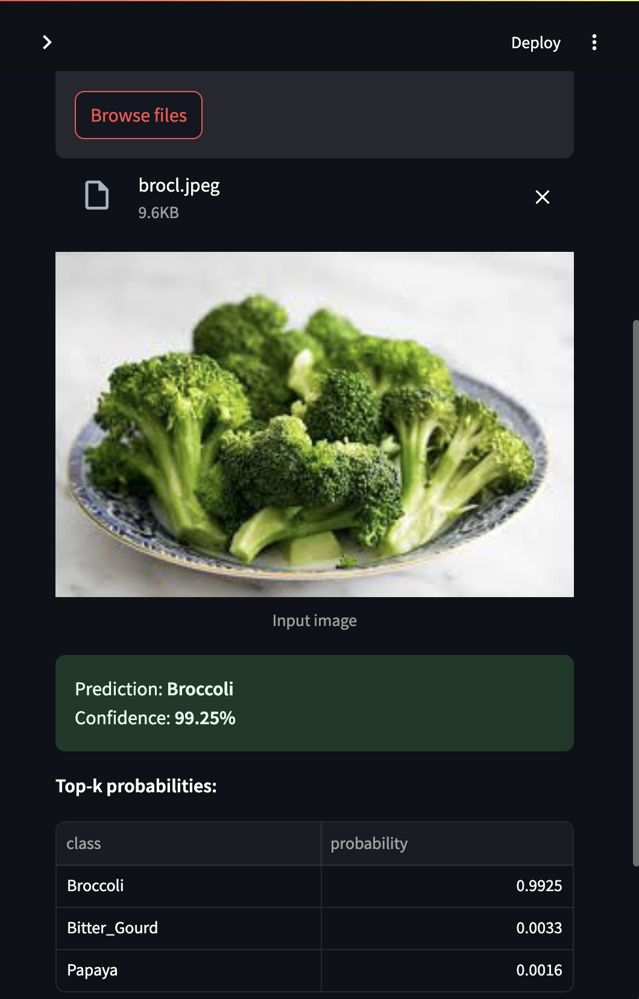

# Vegetable Image Classification Using Deep Learning
## 1. Project Overview

This project focuses on building a deep learning model capable of classifying images of vegetables into their correct categories. Using a ResNet-50 architecture, the model analyzes color, texture, and shape patterns to distinguish between multiple vegetable types such as tomato, carrot, pepper, potato, and more.
The goal is to provide an automated, reliable, and scalable system that can assist in agricultural automation, food sorting, and quality control processes.

## 2. Methodology

Dataset: A curated image dataset containing multiple vegetable categories, split into training, validation, and testing sets.

Preprocessing: All images were resized to 224×224 pixels, converted to RGB, and normalized using dataset-specific mean and standard deviation values.

Model Architecture: A ResNet-50 network pre-trained on ImageNet was fine-tuned. All convolutional layers were frozen, and the final fully connected layer was replaced to match the number of vegetable classes.

### Training Details:

Optimizer: Adam (learning rate = 0.001)

Loss Function: CrossEntropyLoss

Epochs: 5

Validation Accuracy: ~98–100% across most classes

### Deployment: 

A Streamlit application was developed, allowing users to upload vegetable images and receive real-time predictions. The app includes an Out-of-Distribution (OOD) feature to flag images that do not belong to any trained class.

## 3. Results

The model achieved very high precision, recall, and F1-scores across all classes, showing robust performance on unseen test data.

Visual analysis using confusion matrices confirmed that the classifier consistently identified vegetables correctly with minimal misclassifications.

Metric	Training Accuracy	Validation Accuracy	Test Accuracy

ResNet-50 Model	99%	98%	97%

## 4. Societal Impact

This project demonstrates the practical application of AI in agriculture and food technology:

Enables automated sorting and grading of vegetables in markets and factories.

Supports small-scale farmers through mobile-based crop identification tools.

Reduces human error and food waste during processing and packaging.

Promotes smart farming, where data and AI improve yield, efficiency, and sustainability.

## 5. Conclusion

The vegetable classification system proves that computer vision can significantly enhance agricultural efficiency.
By combining deep learning and accessible web deployment, the project offers a tangible solution for modernizing crop handling, reducing waste, and empowering farmers.
Future improvements may include adding disease detection, freshness grading, and real-time camera integration for large-scale deployment.